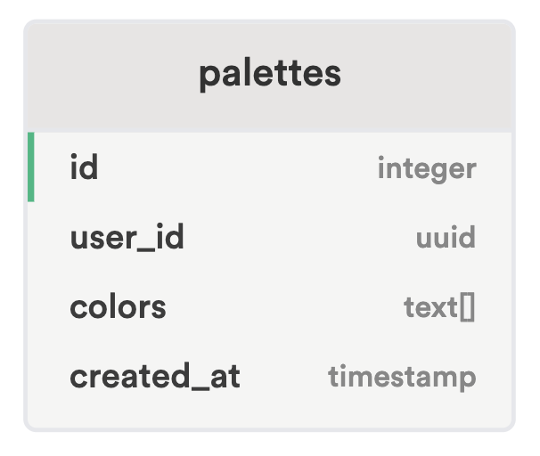

# アプリケーション名

Palette Mate

## アプリケーション概要

**Palette Mate**は、Huemint（[https://huemint.com/](https://huemint.com/)）という配色ツールを参考にした Web アプリケーションです。Huemint は、機械学習を活用してグラフィックデザイン用の色を生成します。単にフラットなカラーパレットを生成するのではなく、最終デザインで色がどのように使われるかを考慮して色を生成します。

**Palette Mate**は、Huemint のアプローチを基にしつつ、ユーザーが生成された配色を保存・管理できる「お気に入り登録機能」を追加しました。これにより、ユーザーは自分の好みに合わせた配色を簡単に作成・保存し、後で確認することができます。デザイン初心者でも色選びが簡単にできるよう、直感的で使いやすいインターフェースを提供します。

## URL

デプロイ済みのアプリケーションへのリンクを記載します。  
[https://palette-mate-q0qio83mc-ota725s-projects.vercel.app/brand/2](https://palette-mate-q0qio83mc-ota725s-projects.vercel.app/brand/2)  
（デプロイ先 URL）

## テスト用アカウント
**※ 個人情報のため、現在アカウントの新規登録機能は停止しています。**
- **ID**: `12345@example.com`
- **Password**: `aiueo123`

## 利用方法

1. 上記の URL にアクセスします。
2. 色の提案や保存機能を使って、配色を自由に作成・保存できます。
3. 「お気に入り」機能を利用する場合はログインを行います。好みの配色を後で確認することができます。

## 目指した課題解決

お気に入り機能を追加することで、ユーザーはいつでもどこでも、どのデバイスからでも配色を保存・管理できるようにし、通勤通学途中などでもスムーズに利用できるようにしました。

## 洗い出した要件

- ユーザー登録・ログイン機能
- 配色提案機能
- 配色の保存機能（お気に入り）
- お気に入り配色の管理機能
- ユーザーが保存した配色の閲覧機能
- レスポンシブデザイン

## 実装した機能について

### 配色提案機能

ユーザーがボタンを押すと、**Huemint API** を使用して調和のとれたカラーパレットを提案します。  
機械学習モデルを用いた生成アルゴリズムを活用しています。

### 色のカスタマイズ機能

特定の色を自由に設定することができます。

色を固定して新たに配色を生成することができます。

### お気に入り機能

お気に入りボタンを押すことで、現在の配色をお気に入りに登録できます。

## 今後実装予定の機能

- グラデーションの配色提案モード
- ログイン処理などの loading 表示
- お気に入り登録の際、ログイン画面に遷移した場合の配色の保持

## データベース

以下はデータベースの ER 図です。  

本データベースは、お気に入り登録された配色を管理するシンプルな構成です。

## 技術スタック

- Next.js 15.0.3 (App Router)
- React 19
- TailwindCSS
- TypeScript
- Supabase
- Vercel
- ESLint, Perttier, Git, GitHub
